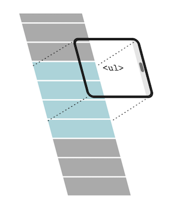

# Virtualized Lists with Table

Building a simple React Typescript app to build a virtualized list

This project was bootstrapped with [Create React App](https://github.com/facebook/create-react-app).

## What is a Virtualized List?

Lists render a windowed list (row) of elements meaning that only the visible rows are displayed to users. In this case the Lists use a Table (internally) to render rows, relaying props to that inner Grid.

## How to start the project

### `npm i`
### `npm start`

Runs the app in the development mode.\
Open [http://localhost:3000](http://localhost:3000) to view it in the browser.

The page will reload if you make edits.\
You will also see any lint errors in the console.

### `npm test`

Launches the test runner in the interactive watch mode.\
See the section about [running tests](https://facebook.github.io/create-react-app/docs/running-tests) for more information.

### `npm run build`

Builds the app for production to the `build` folder.\
It correctly bundles React in production mode and optimizes the build for the best performance.

The build is minified and the filenames include the hashes.\
Your app is ready to be deployed!

See the section about [deployment](https://facebook.github.io/create-react-app/docs/deployment) for more information.

## Considerations

- When I was creating the logic for the component, and ended build the Virtualized list based on React Virtulize: https://github.com/junqiuzhang/react-virtualize, and customizing for a table.

You can learn more in the [Create React App documentation](https://facebook.github.io/create-react-app/docs/getting-started).

To learn React, check out the [React documentation](https://reactjs.org/).

## To do
- Calculate the scroll position to the bottom of the scrolling list, so when we add a new item goes to bottom
